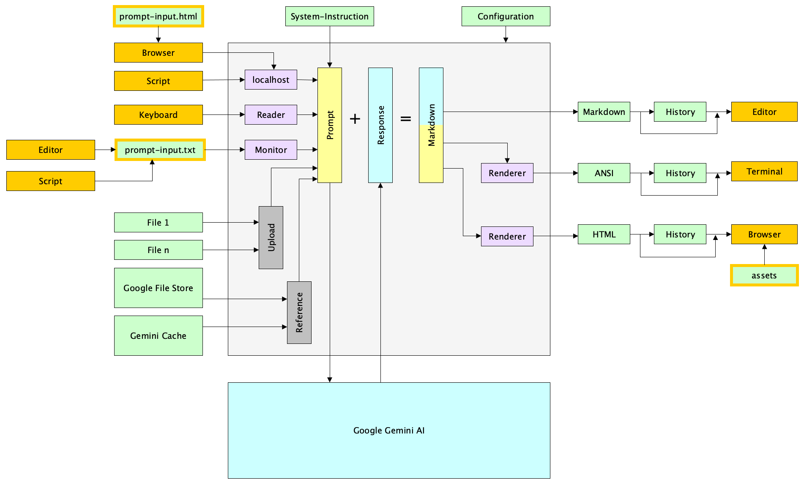

English version below ...

### Zweck

Dieses Programm ermöglicht die Interaktion mit Google Gemini AI, um Prompts zu senden und Antworten in verschiedenen Formaten (Markdown, ANSI, HTML) zu empfangen. Das Ziel ist die nahtlose Integration von KI-Funktionen in den Arbeitsablauf des Benutzers durch die Unterstützung verschiedener Eingabe- und Ausgabekanäle sowie einer Historienverwaltung.

Das Programm ist für BSD, Linux, macOS und Windows verfügbar.

### Google Gemini KI

Dieses Programm erlaubt die Nutzung verschiedener Modelle der Google Gemini KI-Familie. Viele Parameter des KI-Modells, wie z.B. die Anzahl der Antworten oder die Varianz, können in der Konfiguration angepasst werden.

### Google Gemini KI-Modelle

Die Gemini KI-Familie besteht aus folgenden (Text-) Modellen:

| | **Lite** (Spezial) | **Flash** (Standard) | **Pro** (High-End) |
| :--- | :--- | :--- | :--- |
| **Am Besten geeignet für** | Einfache, massive Volumen-Anfragen | Programmierung, Reasoning, komplexe Standardanfragen | Programmierung, umfangreiches Reasoning, hohe Komplexität, große Kontexte |
| **Geschwindigkeit** | sehr hoch | hoch | mittel / niedrig |
| **Leistung** | niedrig / mittel | hoch | sehr hoch |
| **Kosten** | sehr niedrig | niedrig / mittel | hoch |

Für diesen KI-Client bietet sich die wahlweise Nutzung der KI-Modelle "Flash" und "Pro" an.

### Funktionsumfang

*   **Flexible Eingabequellen:** Terminal, Datei-Polling (für Watch-Modus) und HTTP (localhost).
*   **Umfassendes Datei-Handling:**
    *   Lokale Dateien direkt im Prompt.
    *   Temporäre Uploads via Google File Store (für große Kontextfenster).
    *   **RAG (Retrieval-Augmented Generation):** Persistente Wissensbasis mittels FileSearchStores für große Dokumentensammlungen.
*   **Context Caching:** Erstellung und Wiederverwendung von Caches (Context Caching) zur Reduzierung von Kosten und Latenz bei großen Prompts.
*   **Erweitertes Grounding & Tools:**
    *   **Google Search:** Für aktuelle Informationen aus dem Web.
    *   **URL Context:** Gezieltes Verarbeiten von Webseiteninhalten.
    *   **Google Maps:** Für standortbezogene Abfragen.
    *   **Code Execution:** Ausführung von Python-Code zur Lösung komplexer Rechen- oder Logikaufgaben.
*   **Unterstützung moderner Modell-Features:**
    *   **Thinking Models:** Anzeige der internen "Gedankengänge" (Thoughts) bei Reasoning-Modellen.
    *   **System Instructions:** Steuerung des Modellverhaltens durch System-Prompts.
*   **Konfigurierbare Ausgabeformate:**
    *   Markdown (für Editoren).
    *   ANSI (farbiges Terminal, mittels `glamour` Renderer).
    *   HTML (für Browser, inkl. Syntax-Highlighting).
*   **History & Chat:**
    *   Speicherung des Verlaufs für alle Formate.
    *   Chat-Modus für konversationelle Interaktionen (Session-Gedächtnis).
*   **Enterprise & Konfiguration:**
    *   Proxy-Unterstützung.
    *   Detaillierte Konfiguration (YAML, CLI-Flags, Environment).
    *   OS-spezifische Integration (Benachrichtigungen, Standard-Applikationen).
    *   MIME-Type Ersetzungen für spezielle Dateiformate.

### Installation, Konfiguration

Die Anwendung enthält intern alle für die Nutzung notwendigen Komponenten. Laden Sie die passende ausführbare Binärdatei für Ihr Betriebssystem unter [Releases] herunter. Daher ist es ausreichend, die Anwendung in ein beliebiges Verzeichnis zu kopieren und zu starten. Dies ermöglicht eine einfache projektbezogene Nutzung der Anwendung. Die Anwendung kann umfangreich über eine YAML-Datei konfiguriert werden.

### Eingabe der Abfragen

Abfragen können über verschiedene Kanäle eingegeben werden: direkt im Terminal, über die Textdatei 'prompt-input.txt', oder über 'localhost' (Port 4242). Für eine komfortablere Prompterstellung und -ausführung kann die Webseite 'prompt-input.html' verwendet werden.

### Ausgabe der Abfrage+Antwort-Paare

Die Abfrage+Antwort-Paare werden in verschiedenen Formaten ausgegeben: im Terminal (ANSI-farbig), als Markdown-Dateien (für Editoren/Viewer) und als HTML-Seiten (für Browser). Die Browser-Ausgabe bietet umfangreiche Anpassungs- und Nutzungsmöglichkeiten.

### Benachrichtigungen

Benachrichtigungen informieren optional über den Start und Abschluss der Prompt-Verarbeitung, weil die Antwortgenerierung durch KI einige Zeit in Anspruch nehmen kann.

### Nutzung und Hinweise

Dieses Programm kann im Terminal für direkte Eingabe und Ausgabe genutzt werden oder als Controller mit Eingabe per Datei/localhost und Ausgabe in GUI-Programmen.

Hinweise zum Nicht-Chat-Modus (Standard):

* Jeder Prompt wird unabhängig behandelt.
* Die KI erinnert sich nicht an frühere Interaktionen.
* Dateien werden mit jedem Prompt gesendet.

Hinweise zum Chat-Modus (-chatmode Flag):

* Die KI merkt sich den Gesprächsverlauf innerhalb einer Sitzung.
* Dateien werden nur mit dem ersten Prompt gesendet.

**Wichtig**: Diese Anwendung ist zur Nutzung der Google Gemini KI mit einem persönlichen Gemini API-Key gedacht. Beachten Sie die Hinweise zu Nutzungsbedingungen und Datenschutz im folgenden Abschnitt. 

### Nutzungsbedingungen und Datenschutzhinweise

Beachten Sie die [Google-Nutzungsbedingungen](https://policies.google.com/terms) und die [Richtlinie zur unzulässigen Nutzung von generativer KI](https://policies.google.com/terms/generative-ai/use-policy) für Gemini. Weitere Informationen zum Datenschutz finden Sie im [Gemini-Apps Privacy Hub](https://support.google.com/gemini?p=privacy_help).

**Wichtig**: Die frei verfügbare Version von Google Gemini AI nutzt Ihre Eingabe- und Ausgabedaten zur Verbesserung des Modells. Verarbeiten Sie daher keine privaten oder vertraulichen Daten. Für die kostenpflichtige Version gelten andere Datenschutzrichtlinien.

Siehe auch [häufig gestellte Fragen zu Gemini-Apps](https://gemini.google.com/faq?hl=de).

### Technische Hinweise

Jedes Gemini-KI-Modell hat ein maximales Output-Token-Limit, welches die Antwortlänge begrenzt. Ein Token entspricht etwa 4 Zeichen, 100 Token in etwa 60 bis 80 englischen Wörtern. Wenn das KI-Modell das Output-Token-Limit beispielsweise auf 65536 Tokens definiert, entspricht dies einer maximalen Antwortlänge von 39300 bis 52400 englischen Wörtern.

### Voraussetzungen und Konfiguration

Für die Nutzung ist ein persönlicher Gemini API-Key von Google erforderlich. Konfigurieren Sie den API-Key als Umgebungsvariable ```GEMINI_API_KEY```. Für die Internetverbindung kann optional ein Proxy konfiguriert werden.

* Konfiguration des API-Keys im Programm-Environment:
  * macOS, Linux: ```export GEMINI_API_KEY=Your-API-Key```
  * Windows: ```setx GEMINI_API_KEY Your-API-Key``` (erfordert Neustart des Terminals)

* **Erweiterte Modell-Konfiguration:** In der Datei `gem-pro.yaml` können für aktuelle Modelle (z.B. Gemini 3) das **Thinking Level** (Intensität der Denkprozesse, z.B. `high`) sowie die **Input Media Resolution** (Auflösung für PDF-, Bild- oder Video-Input) angepasst werden.

### Umgang mit Dateien

Abhängig vom Einsatzfall stehen verschiedene Möglichkeiten zur Nutzung von Dateiinhalten im Kontext "Prompt" zur Verfügung.

* Ein textueller Dateiinhalt wird direkt in den Prompt eingefügt.
* Ein Satz an Dateien (1-n) wird über die Kommandozeile definiert:
  * Die Dateien werden anschließend automatisch Bestandteil des Prompts.
* Ein Satz an Dateien (1-n) wird zunächst in den Google-File-Store hochgeladen:
  * Über die Option '-include-files' werden die Dateien anschließend Bestandteil des Prompts.

Die vorgenannten Varianten sind kombinierbar und unterscheiden sich in ihrer Wirkung auf den Prompt nicht. Liegt der zu berücksichtigende Satz an Dateien bereits im Google-File-Store vor, so genügt es im Prompt darauf zu referenzieren. Ein wiederholtes, zeitaufwändiges Hochladen mit jedem neuen Prompt ist somit nicht notwendig. Die Lebensdauer der Dateien im Google-File-Store ist begrenzt. Die Dateien werden nach einer bestimmten Zeit (z.B. 48 Stunden) automatisch gelöscht. Der Satz an Dateien im Google-File-Store wird als 'Einheit' betrachtet und immer vollständig im Prompt referenziert.

**Zusammenfassung der Strategien zur Datei-Integration:**

Je nach Datenmenge und Verwendungszweck empfiehlt sich einer der folgenden Ansätze:
*   **Direkt:** Textinhalt wird Teil des Prompts (flüchtig, für kleine Datenmengen).
*   **Google File Store:** Upload via API (temporär ca. 48h verfügbar, für mittelgroße Datenmengen/Kontexte).
*   **FileSearchStores (RAG):** Persistente Indexierung im Store (dauerhaft verfügbar, optimiert für sehr große Dokumentensammlungen).

**Nutzung von Dateilisten (`-filelist`):**
Statt viele Dateien einzeln in der Kommandozeile zu nennen, können diese in einer Datei aufgelistet werden. 
Leere Zeilen sowie Zeilen, die mit `#` oder `//` beginnen (Kommentare), werden ignoriert.

*Beispielinhalt von `sources.txt`:*
```text
# Quelldateien
main.go
config.go

// Dokumentation
README.md
```

*Aufruf:*
```bash
gem-pro -filelist sources.txt
```

### Umgang mit einem expliziten Cache

Ein Cache beinhaltet 1-n Dateien. Die Dateien werden bei der Erzeugung des Caches tokenisiert. Ein Cache bietet somit zwei Vorteile:

* Im Prompt kann auf den Cache referenziert werden.
* Die aufwändige Tokenisierung erfolgt nur einmal.

Je größer der Cache ist, desto vorteilhafter ist dessen Nutzung. Ein Cache ist kostenpflichtig. Richtig eingesetzt sind schnellere Antwortzeiten und geringere Gesamtkosten möglich. Die Lebensdauer eines Caches kann konfiguriert werden (z.B. 4 h). Das gewählte KI-Modell muss 'Caching' unterstützen. Beim Anlegen wird der Cache vom aktuell gewählten KI-Modell tokenisiert. Anschließend kann der Cache auch nur von diesem KI-Modell genutzt werden.

In einem Prompt kann nur ein Cache referenziert werden. Alle Cache-Operationen wirken deshalb immer auf einen modell-spezifischen Cache mit dem logischen Namen "gem-pro-cache" (konfigurierbar). Dieser wird über die Option '-include-cache' in den Prompt übernommen. 

### Impliziter Cache im Chat-Modus

Eine hervorragende Möglichkeit des (impliziten) Cachings bietet der Chat-Modus. Hier werden die Dateien nur bei Eröffnung einer Session, also als Bestandteil des ersten Prompts, übertragen und tokenisiert. Gemini cached diese Daten, sodass sie bei nachfolgenden Prompts (implizit) zur Verfügung stehen.

### Tooling

Um die Fähigkeiten des KI-Modells zu erweitern, können spezialisierte Werkzeuge (Tools) genutzt werden. Diese ermöglichen es dem Modell, auf externe Informationen zuzugreifen oder komplexe Operationen auszuführen, die über die reine Textgenerierung hinausgehen.

#### Grounding mit Google Search

Ist dieses Tool aktiviert, nutzt das KI-Modell die Google-Suchmaschine als dynamisches Werkzeug. Es dient primär der **Informationsbeschaffung** zu Themen, die nicht im Trainingswissen des Modells enthalten sind oder sich ständig ändern.

*   **Autonome Recherche:** Das Modell erkennt eigenständig, wann eine externe Recherche notwendig ist (z. B. "Wie spielte Bayern München gestern?"). Es formuliert Suchanfragen, analysiert die Ergebnisse und synthetisiert eine Antwort.
*   **Breite statt Tiefe:** Dieses Tool ist ideal, um Fakten zu verifizieren, aktuelle Ereignisse abzufragen oder einen Überblick über ein Thema zu erhalten, ohne dass der Benutzer eine spezifische Quelle vorgibt.

#### Grounding mit URL-Kontext

Ist dieses Tool aktiviert, verarbeitet das KI-Modell den Inhalt exakter URLs, die im Prompt übergeben werden. Es dient der **Informationsverarbeitung** einer spezifischen, vom Benutzer definierten Quelle.

*   **Fokussiertes Lesen:** Im Gegensatz zur Google Search sucht das Modell hier nicht nach Informationen, sondern liest und analysiert den Inhalt der bereitgestellten Webseite (bis zu einer bestimmten Token-Grenze).
*   **Präzision:** Da die Datenbasis auf die angegebene URL beschränkt ist (Grounding), halluziniert das Modell weniger und bezieht sich exakt auf den dortstehenden Text.
*   **Anwendungsfälle:**
    *   *Fasse diesen Artikel zusammen: [URL]*
    *   *Welche Garantiebedingungen stehen auf dieser Seite? [URL]*
    *   *Analysiere den Schreibstil dieses Blogposts: [URL]*

#### Zusammenspiel der Tools (Google Search & URL-Kontext)

Wenn **beide** Tools aktiviert sind, kann das KI-Modell seine Fähigkeiten kombinieren, um komplexe Anfragen zu beantworten, die sowohl tiefes Verständnis einer Quelle als auch breites Kontextwissen erfordern.

Das Modell entscheidet intelligent, welches Tool für welchen Teil der Anfrage eingesetzt wird:

1.  **Verstehen + Verifizieren:** Das Modell nutzt *URL-Kontext*, um den Inhalt einer gegebenen Webseite präzise zu lesen, und *Google Search*, um die dort gemachten Behauptungen gegen andere Quellen im Internet zu prüfen (Faktencheck).
    *   *Beispiel:* "Lies diesen Artikel [URL] und prüfe mittels Google Suche, ob die genannten Statistiken noch aktuell sind."
2.  **Kontextualisierung:** Das Modell analysiert eine spezifische Quelle (*URL-Kontext*) und sucht anschließend nach Hintergrundinformationen zum Autor oder zum Thema (*Google Search*), die nicht auf der Seite selbst stehen.
    *   *Beispiel:* "Fasse diesen Blogpost [URL] zusammen und sag mir, wer der Autor ist und was er sonst noch geschrieben hat."

#### Grounding mit Google Maps

Ist dieses Tool aktiviert, kann das KI-Modell auf die umfangreichen und aktuellen Geodaten von Google Maps zugreifen. Dies ermöglicht präzisere, relevantere und faktenbasierte Antworten auf standortbezogene Anfragen. Das Modell kann so Informationen zu Orten, Routen oder Umgebungen direkt in seine Antworten integrieren und diese mit kontextuellen Details anreichern.

*Standortbezogene Fakten:* Bei Fragen zu spezifischen Orten, wie "Welche vegetarischen Restaurants gibt es in der Nähe des Brandenburger Tors mit guten Bewertungen?", nutzt das Modell Google Maps, um aktuelle Informationen wie Adressen, Öffnungszeiten und Nutzerbewertungen zu liefern. Dadurch werden die Antworten sachlicher und aktueller.

*Kontextuelles Verständnis:* Das Tool ermöglicht es dem Modell, räumliche Zusammenhänge zu verstehen. Auf eine Anfrage wie "Schlage eine Route für einen Spaziergang in Berlin vor, die an historischen Sehenswürdigkeiten vorbeiführt" kann das Modell eine logische und thematisch passende Wegbeschreibung erstellen, die auf den realen Gegebenheiten von Google Maps basiert.

#### Grounding mit FileSearchStores (RAG)

Ist dieses Tool aktiviert, nutzt das KI-Modell einen oder mehrere vom Benutzer definierte 'FileSearchStores' als Wissensbasis. Dies ist der **primäre Weg**, um das KI-Modell mit umfangreichem, spezialisiertem oder firmeninternem Wissen anzureichern, das in Dokumentenform vorliegt (unstrukturierte Daten).

Dieses Verfahren wird als *RAG* (Retrieval-Augmented Generation) bezeichnet. Im Gegensatz zum direkten Hochladen von Dateien in den Prompt (wo der Inhalt Teil des Kontextfensters wird), durchsucht das Modell hierbei den Store gezielt nach Informationen, die für die Beantwortung der aktuellen Anfrage relevant sind.

Dies eignet sich hervorragend für große, statische Dokumentensammlungen (z. B. technische Handbücher, Gesetzestexte, Firmenrichtlinien, Wikis), die viel zu umfangreich für einen einzelnen Prompt wären. Das Modell zitiert in der Regel die Fundstellen aus dem Store in seiner Antwort.

#### Grounding mittels Function Calling

Function Calling ist der **sekundäre Weg**, um das Wissen des Modells zu erweitern – spezifisch für dynamische Daten, Echtzeit-Informationen oder konkrete Vorgänge, die nicht in statischen Dokumenten stehen (strukturierte Daten).

Spezielles, firmeninternes Wissen liegt oft in Datenbanken oder Business-Applikationen vor (z. B. "Wie ist der Status von Ticket 123?", "Lagerbestand von Artikel X"). Function Calling ermöglicht dem KI-Modell, über definierte Schnittstellen (APIs) solche punktuellen Abfragen zu tätigen und die Ergebnisse in die Antwort einfließen zu lassen.

*Hinweis:* Da die technische Umsetzung von Function Calling (die Definition der API-Endpunkte und die Ausführung des Codes) hochgradig spezifisch für die jeweilige Umgebung des Anwenders ist, ist die Ausführung von benutzerdefinierten Funktionen nicht Bestandteil dieses allgemeinen KI-Clients.

#### Grounding mittels Code Execution

Dieses Tool erlaubt es dem KI-Modell, Code (in der Regel Python) zu generieren, auszuführen und zu validieren, um eine Lösung für eine Anfrage zu finden. Dies ist besonders nützlich für mathematische Berechnungen, Datenanalysen oder logische Probleme, bei denen eine exakte Ausführung von Schritten erforderlich ist. Das Modell kann so Aufgaben lösen, die präzise und wiederholbare Ergebnisse erfordern.

### Gemini KI-Modelle

Im Kontext dieser Applikation sind folgende KI-Modell-Linien von besonderem Interesse:

* **Flash**-Linie mit den Stärken hohe Geschwindigkeit und Kosteneffizienz, Vielseitigkeit
* **Pro**-Linie mit den Stärken maximale Leistung und Genauigkeit, fortgeschrittenes Schlussfolgern, Programmierunterstützung

Je nach Aufgabenstellung kann auch die Nutzung beider Modell-Linien hilfreich sein:

* Flash-Linie: Generierung mehrerer Lösungsvarianten
* Benutzer: Auswahl der besten Lösungsvariante
* Pro-Linie: Verfeinerung der ausgewählten Lösungsvariante

### Wichtige Parameter

* **Temperature**: Steuert die Zufälligkeit der Ausgabe.
    *   *Hinweis zu Gemini 3 / Reasoning Modellen:* **Belassen Sie diesen Wert auf dem Standard (leer/1.0).** Diese Modelle benötigen eine gewisse Varianz ("Kreativität") für ihre internen Denkprozesse. Ein Absenken der Temperature führt hier paradoxerweise zu schlechterer Logik und Fehlern (z.B. Endlosschleifen).

* **TopP (Nucleus Sampling)**: Filtert die Wortauswahl basierend auf kumulativer Wahrscheinlichkeit. Sollte für Gemini 3 in der Regel ebenfalls auf dem Standardwert belassen werden.

**Empfehlung:**
Die Steuerung der Genauigkeit erfolgt bei Gemini 3 primär über den Prompt und nicht mehr über die Sampling-Parameter. Ändern Sie diese Werte in der Konfiguration nur, wenn Sie ältere Modelle nutzen oder spezifische Experimente durchführen.

#### Defaultwerte

Die Standardwerte für die Gemini-Modelle sind in der Regel:
*   **Temperature**: 1.0
*   **TopP**: 0.95

### Support und Programme

Programmfehler bitte in 'Issues' melden, Diskussionen und Fragen in 'Discussions'. Ausführbare Programme finden Sie im 'Releases'-Bereich.

***



***

### Purpose

This program enables interaction with a Google Gemini AI model to send prompts and receive responses in various formats (Markdown, ANSI, HTML). It aims to seamlessly integrate AI capabilities into the user's workflow by supporting various input and output channels along with a history feature.

The program is available for BSD, Linux, macOS, and Windows.

### Google Gemini AI

This program allows the use of various models from the Google Gemini AI family. Many parameters of the AI model, such as the number of responses or variance, can be adjusted in the configuration.

### Google Gemini AI Models

The Gemini AI family consists of the following (text) models:

| | **Lite** (Special) | **Flash** (Standard) | **Pro** (High-End) |
| :--- | :--- | :--- | :--- |
| **Best suited for** | Simple, massive volume requests | Programming, reasoning, complex standard requests | Programming, extensive reasoning, high complexity, large contexts |
| **Speed** | very high | high | medium / low |
| **Performance** | low / medium | high | very high |
| **Cost** | very low | low / medium | high |

For this AI client, the optional use of the "Flash" and "Pro" AI models is suitable.

### Features

*   **Flexible Input Sources:** Terminal, file polling (watch mode), and HTTP (localhost).
*   **Comprehensive File Handling:**
    *   Local files directly in the prompt.
    *   Temporary uploads via Google File Store (for large context windows).
    *   **RAG (Retrieval-Augmented Generation):** Persistent knowledge base using FileSearchStores for large document collections.
*   **Context Caching:** Creation and reuse of caches (Context Caching) to reduce costs and latency for large prompts.
*   **Advanced Grounding & Tools:**
    *   **Google Search:** For up-to-date information from the web.
    *   **URL Context:** Targeted processing of specific webpage content.
    *   **Google Maps:** For location-based queries.
    *   **Code Execution:** Python code execution for solving complex calculation or logic tasks.
*   **Support for Modern Model Features:**
    *   **Thinking Models:** Display of internal "thoughts" for reasoning models.
    *   **System Instructions:** Steer model behavior via system prompts.
*   **Configurable Output Formats:**
    *   Markdown (for editors).
    *   ANSI (colored terminal output using `glamour`).
    *   HTML (for browsers, incl. syntax highlighting).
*   **History & Chat:**
    *   History storage for all output formats.
    *   Chat mode for conversational interactions (session memory).
*   **Enterprise & Configuration:**
    *   Proxy support.
    *   Detailed configuration (YAML, CLI flags, environment).
    *   OS-specific integration (notifications, default applications).
    *   MIME-type replacements for specific file formats.

### Installation, Configuration

The application internally includes all components required for use. Download the appropriate executable binary for your operating system from the [Releases] section. Therefore, copying the application to a directory and starting it is sufficient. This allows for simple project-related use. The application can be extensively configured via a YAML file.

### Input of Prompts

Prompts can be entered via various channels: directly in the terminal, via the text file 'prompt-input.txt', or through 'localhost' (Port 4242). For more convenient prompt creation and execution, the webpage 'prompt-input.html' can be used.

### Output of Prompt+Response Pairs

The output of prompt+response pairs is available in various formats: in the terminal (ANSI colored), as Markdown files (for editors/viewers), and as HTML pages (for browsers). The browser output offers extensive customization and usage options.

### Notifications

Optional notifications inform users about the start and completion of prompt processing, as AI response generation can take some time.

### Usage and Notes

This program can be used in a terminal for direct input and output or as a controller with input via file/localhost and output in GUI programs.

Notes regarding non-chat mode (default):

* Each prompt is treated independently.
* The AI does not remember previous interactions.
* Files are sent with every prompt.

Notes concerning the chat mode (-chatmode flag):

* The AI remembers the conversation history within a session.
* Files are sent only with the initial prompt.

Important: This application is intended for use with Google Gemini AI using a personal Gemini API key. Please note the terms of service and privacy information in the following section.

### Terms of Service and Privacy Notes

Refer to the [Google Terms of Service](https://policies.google.com/terms) and the [Generative AI Prohibited Use Policy](https://policies.google.com/terms/generative-ai/use-policy) for Gemini. For more information on privacy, please visit the [Gemini Apps Privacy Hub](https://support.google.com/gemini?p=privacy_help).

**Important**: The freely available version of Google Gemini AI uses your input and output data to improve the model. Therefore, do not process any private or confidential data. Different privacy policies apply to the paid version.

See also [Gemini Apps FAQ](https://gemini.google.com/faq?hl=en).

### Technical Notes

Each Gemini AI model has a maximum output token limit, which restricts the response length. One token roughly corresponds to approximately 4 characters, 100 tokens to about 60 to 80 English words. If, for example, the AI model defines the output token limit as 65536 tokens, that corresponds to a maximum response length of 39300 to 52400 English words.

### Required Prerequisites

A personal Gemini API key from Google is required for use. Configure the API key as an environment variable ```GEMINI_API_KEY```. An internet proxy can be optionally configured for the internet connection.

* Configure the API key in the program environment:
  * macOS, Linux: ```export GEMINI_API_KEY=Your-API-Key```
  * Windows: ```setx GEMINI_API_KEY Your-API-Key``` (requires terminal restart)

* **Advanced Model Configuration:** In the `gem-pro.yaml` file, you can adjust the **Thinking Level** (intensity of reasoning processes, e.g., `high`) and **Input Media Resolution** (resolution for pdf, image or video input) for current models (e.g., Gemini 3).

### File Handling

Depending on the use case, various options are available for utilizing file contents within the "Prompt" context.

* The content of a textual file is directly inserted into the prompt.
* A set of files (1 or more) is defined via the command line:
  * The files subsequently automatically become part of the prompt.
* A set of files (1 or more) is first uploaded to the Google File Store:
  * Via the '-include-files' option, the files subsequently become part of the prompt.
  
The aforementioned variants can be combined and do not differ in their effect on the prompt. If the set of files to be considered already exists in the Google File Store, it is sufficient to reference it in the prompt. Repeated, time-consuming uploading with every new prompt is therefore not required. The lifespan of the files in the Google File Store is limited. The files are automatically deleted after a certain time (e.g., 48 hours). The set of files in the Google File Store is considered as a 'unit' and is always fully referenced in the prompt.

**Summary of File Integration Strategies:**

Depending on the data volume and use case, one of the following approaches is recommended:
*   **Direct:** Text content becomes part of the prompt (volatile, for small data sets).
*   **Google File Store:** Upload via API (available temporarily for ~48h, for medium-sized data sets/contexts).
*   **FileSearchStores (RAG):** Persistent indexing in a store (permanently available, optimized for very large document collections).

**Using File Lists (`-filelist`):**
Instead of specifying many files individually on the command line, they can be listed in a file.
Empty lines and lines starting with `#` or `//` (comments) are ignored.

*Example content of `sources.txt`:*
```text
# Source files
main.go
config.go

// Documentation
README.md
```

*Command:*
```bash
gem-pro -filelist sources.txt"
```

### Handling an Explicit Cache
A cache contains 1-n files. The files are tokenized when the cache is created. A cache therefore offers two advantages:

* The cache can be referenced in the prompt.
* The complex tokenization process is only performed once.

The larger the cache, the more advantageous its use. Using the cache incurs a cost. When used correctly, faster response times and lower total costs are possible. The lifespan of a cache can be configured (e.g., 4 hours). The chosen AI model must support 'Caching'. Upon creation, the cache is tokenized by the currently selected AI model. Subsequently, the cache can only be used by this AI model.

In a prompt, only one cache can be referenced. Therefore, all cache operations always act on a model-specific cache with the logical name "gem-pro-cache" (configurable). This is included in the prompt using the option '-include-cache'.

### Implicit Cache in Chat Mode

Chat mode offers an excellent way of (implicit) caching. Here, the files are only transferred and tokenized when a session is opened, i.e., as part of the first prompt. Gemini caches this data so that it is (implicitly) available for subsequent prompts.

### Tooling

To extend the capabilities of the AI model, specialized tools can be utilized. These enable the model to access external information or perform complex operations that go beyond mere text generation.

#### Grounding with Google Search

When this tool is enabled, the AI model uses the Google search engine as a dynamic tool. It is primarily used for **information retrieval** regarding topics that are not included in the model's training data or are constantly changing.

*   **Autonomous Research:** The model independently detects when external research is necessary (e.g., "How did Bayern Munich play yesterday?"). It formulates search queries, analyzes the results, and synthesizes an answer.
*   **Breadth over Depth:** This tool is ideal for verifying facts, querying current events, or getting an overview of a topic without the user specifying a specific source.

#### Grounding with URL Context

When this tool is enabled, the AI model processes the content of exact URLs provided in the prompt. It is used for **information processing** of a specific, user-defined source.

*   **Focused Reading:** Unlike Google Search, the model does not search for information here but reads and analyzes the content of the provided webpage (up to a certain token limit).
*   **Precision:** Since the data basis is restricted to the specified URL (Grounding), the model hallucinates less and refers exactly to the text found there.
*   **Use Cases:**
    *   *Summarize this article: [URL]*
    *   *What are the warranty conditions on this page? [URL]*
    *   *Analyze the writing style of this blog post: [URL]*

#### Interaction of Tools (Google Search & URL Context)

When **both** tools are enabled, the AI model can combine its capabilities to answer complex queries requiring both deep understanding of a source and broad contextual knowledge.

The model intelligently decides which tool to use for which part of the query:

1.  **Understand + Verify:** The model uses *URL Context* to precisely read the content of a given webpage and *Google Search* to check the claims made there against other sources on the internet (fact-checking).
    *   *Example:* "Read this article [URL] and check via Google Search if the mentioned statistics are still up to date."
2.  **Contextualization:** The model analyzes a specific source (*URL Context*) and subsequently searches for background information about the author or the topic (*Google Search*) that is not present on the page itself.
    *   *Example:* "Summarize this blog post [URL] and tell me who the author is and what else they have written."

#### Grounding with Google Maps

When this tool is activated, the AI model can access the extensive and up-to-date geodata from Google Maps. This enables more precise, relevant, and fact-based answers to location-based inquiries. The model can thus directly integrate information about places, routes, or surroundings into its responses and enrich them with contextual details.

*Location-based Facts:* For questions about specific places, such as "What are some well-rated vegetarian restaurants near the Brandenburg Gate?", the model uses Google Maps to provide current information like addresses, opening hours, and user ratings. This makes the answers more factual and current.

*Contextual Understanding:* The tool allows the model to understand spatial relationships. In response to a query like "Suggest a walking route in Berlin that passes by historical landmarks," the model can create a logical and thematically appropriate itinerary based on the real-world data from Google Maps.

#### Grounding with FileSearchStores (RAG)

When this tool is enabled, the AI model uses one or more user-defined 'FileSearchStores' as a knowledge base. This is the **primary method** for enriching the AI model with extensive, specialized, or proprietary knowledge available in document form (unstructured data).

This process is referred to as *RAG* (Retrieval-Augmented Generation). Unlike directly uploading files into the prompt (where content becomes part of the context window), the model specifically searches the store for information relevant to answering the current query.

This is ideal for large, static document collections (e.g., technical manuals, legal texts, company policies, wikis) that would be far too extensive for a single prompt. The model typically cites the sources found in the store within its response.

#### Grounding with Function Calling

Function Calling is the **secondary method** for extending the model's knowledge—specifically for dynamic data, real-time information, or specific processes that are not contained in static documents (structured data).

Specialized, proprietary knowledge often resides in databases or business applications (e.g., "What is the status of Ticket 123?", "Current stock of Item X"). Function Calling allows the AI model to perform such specific queries via defined interfaces (APIs) and incorporate the results into the response.

*Note:* Since the technical implementation of Function Calling (defining API endpoints and executing the code) is highly specific to the user's environment, the execution of custom user functions is not part of this general-purpose AI client.

#### Grounding with Code Execution

This tool allows the AI model to generate, execute, and validate code (typically Python) to find a solution to a prompt. This is especially useful for mathematical calculations, data analysis, or logical problems that require a precise execution of steps. It enables the model to solve tasks that demand accurate and repeatable results.

### Gemini AI models

In the context of this application, the following AI model lines are of particular interest:

* **Flash** line with strengths in high speed and cost-efficiency, versatility
* **Pro** line with strengths in maximum performance and accuracy, advanced reasoning, programming support

Depending on the task, using both model lines can also be helpful:

* Flash line: Generation of multiple solution variants
* User: Selection of the best solution variant
* Pro line: Refinement of the selected solution variant

### Important Parameters

* **Temperature**: Controls the randomness of the output.
    *   *Note for Gemini 3 / Reasoning models:* **Keep this value at default (empty/1.0).** These models require a certain amount of variance ("creativity") for their internal reasoning processes. Lowering the temperature can paradoxically lead to worse logic and errors (e.g., infinite loops).

* **TopP (Nucleus Sampling)**: Filters word choice based on cumulative probability. This should generally also be left at the default value for Gemini 3.

**Recommendation:**
With Gemini 3, accuracy is primarily controlled via the prompt rather than these sampling parameters. Only modify these values in the configuration if you are using older models or conducting specific experiments.

#### Default Values

The default values for Gemini models are typically:
*   **Temperature**: 1.0
*   **TopP**: 0.95

### Support and Programs

Please report program errors in 'Issues'. For discussions and questions, please use 'Discussions'. Executable programs are available in the 'Releases' section.
